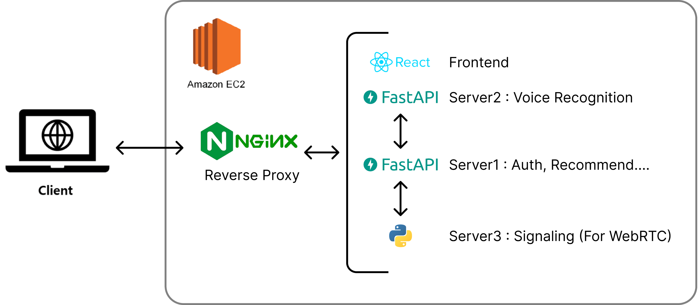

# PATHFINDER

AI 보조 기능을 포함한 실시간 화상 진로상담 서비스

### KHU, 2024-2, Graduation Project

## 프로젝트 요약

PATHFINDER는 경희대학교 2024-2학기 졸업 프로젝트로 개발된 실시간 화상 진로 상담 서비스입니다. 1:1 화상 회의에 기능을 기반으로 Fine-Tuning된 Chatgpt 모델이 실시간으로 상담자에게 적절한 답변을 추천해주고, 내담자의 표정을 인식하는 등의 기능을 제공해줍니다.

## 주요 기능

1. **1:1 화상 상담**  
   WebRTC 기술을 활용하여 실시간으로 원활한 화상 상담을 제공합니다.
2. **AI 어시스턴트**  
   Fine-Tuning된 GPT-4o-mini 모델을 기반으로 상담 중 전문적인 조언과 정보를 제공합니다. 또한 내담자의 표정을 실시간으로 인식하여 상담자에게 알려줍니다.
3. **음성 인식 및 기록**
   Google Cloud Speech API를 활용하여 상담 내용을 텍스트로 변환하고 저장합니다.
4. **상담 보고서 생성**  
   상담 내용을 기반으로 AI가 자동으로 요약 보고서를 작성합니다.

## 기능별 사용 기술

**Frontend** : React.js  
**Backend** : FastAPI, Python  
**화상 통신** : WebRTC  
**음성 인식** : Python SpeechRecognition 라이브러리 상의 Google Cloud Speech API  
**AI 모델** : Fine-Tuning된 GPT-4o-mini  
**배포** : Nginx, EC2

## 아키텍쳐



## 설치 및 실행 방법

1. **Clone Repo**

```bash
git clone https://github.com/TheBreeze129/PATHFINDER.git
```

2. **필수 설치**

```bash
# node.js 16 이상
# Python 3.12 이상
```

3. **프론트엔드 설정 및 빌드**  
   client 디렉토리로 이동하여 필요한 패키지를 설치합니다.

```bash
cd client
npm install
npm run build
# nginx설정을 동일하게 따른다면, 이후 빌드 파일을 /var/www/로 이동시켜주세요.
```

4. **백엔드 설정**  
   server 디렉토리로 이동하여 필요한 패키지를 설치합니다.

```bash
cd server
pip install -r requirements.txt
```

백엔드 서버들을 차례로 실행합니다.

```bash
# 서버1 실행
cd mainserver
uvicorn main:app --host 0.0.0.0 --port {메인서버(서버 1) 포트}
cd ..
cd voiceserver
uvicorn main:app --host 0.0.0.0 --port {음성인식서버(서버 2) 포트}
cd ..
cd siganlingserver
python3.12 sigserver.py
```

5. **Nginx 설정 및 https 인증 등**

```bash
# nginx 설정은 ./deployment/default.conf 를 참고하시길 바라며, https 설정 등은 웹을 참고하여 진행해주시길 바랍니다. 도메인 등이 필요로 됩니다.
```

## 사용 방법

- 웹 브라우저에서 프론트엔드 서버 주소로 접속합니다.
- 회원가입 및 로그인을 진행합니다.
- 화상 상담을 시작합니다.
- 상담 중 AI 어시스턴트의 조언을 참고할 수 있으며, 상담 종료 후 자동 생성된 보고서를 확인할 수 있습니다.

## 기여 방법

- 이 레포지토리를 포크합니다.
- 새로운 브랜치를 생성합니다. (git checkout -b feature/새로운기능)
- 변경 사항을 커밋합니다. (git commit -m '새로운 기능 추가')
- 브랜치에 푸시합니다. (git push origin feature/새로운기능)
- 풀 리퀘스트를 생성합니다.

## 라이선스

이 프로젝트는 MIT 라이선스에 따라 배포됩니다. 자세한 내용은 LICENSE 파일을 참고하세요.

## 프로젝트 참고 문헌

임은미. (2022). 우리나라 학교진로상담의 현황과 개선 방안. 상담학연구, 23(1), 53-66.  
OpenAI. (2024). GPT-4o-mini: Advancing Cost-Efficient Intelligence.  
LLM Lab. (2024). ChatGPT Fine-Tuning Method.
